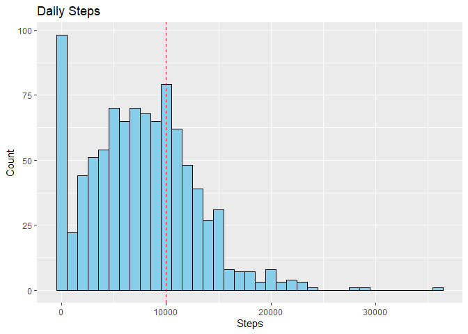
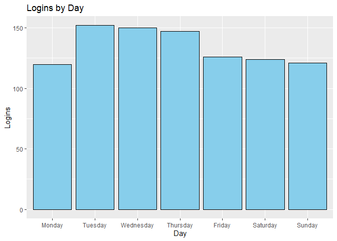
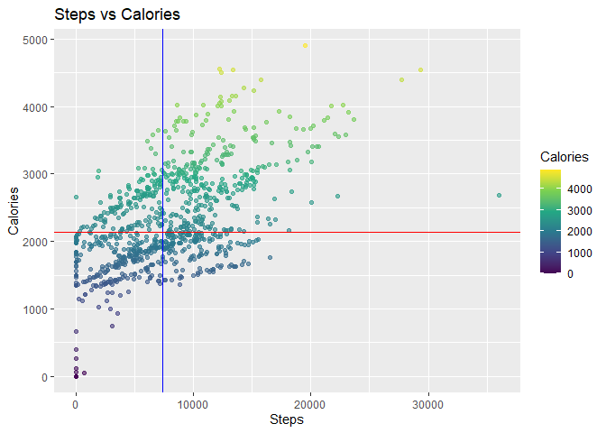
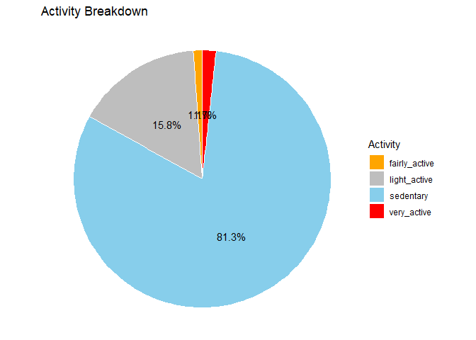

Bellabeat: How Can a Wellness Technology Company Play It Smart?
================
By
Kedon P.


This case study is one of the Capstone Projects of the **Google Data
Analytics Professional Certificate.** To complete this project I
followed the 6 steps of Data Analysis. **Ask, Prepare, Process, Analyze,
Share, Act**

# **STEP 1: ASK**

### **Introduction**

Bellabeat is a high-tech manufacturer of health-focused products for
women. Collecting data on activity, sleep, stress, and reproductive
health has allowed Bellabeat to empower women with knowledge about their
own health and habits.Since it was founded in 2013, Bellabeat has grown
rapidly and quickly positioned itself as a tech-driven wellness company
for women.

The co-founder and Chief Creative Officer, Urška Sršen believes that
analyzing smart device fitness data from competitors could help unlock
new growth opportunities for the company.

#### **Business Task:**

Analyze Fitbit Fitness Tracker Data provided by Mobius to gain insights
into how consumers use competitor smart devices.

#### **Business Objectives:**

1.  What are some trends in smart device usage?
2.  How could these trends apply to Bellabeat customers?
3.  How could these trends help influence Bellabeat marketing strategy?

#### **Deliverables:**

1.  A clear summary of the business task
2.  A description of all data sources used
3.  Documentation of any cleaning or manipulation of data
4.  A summary of your analysis
5.  Supporting visualizations and key findings
6.  High-level content recommendations based on you analysis

#### **Key Stakeholders:**

1.  Bellabeat founders: Urška Sršen & Sando Mur
2.  Bellabeat marketing analytics team

------------------------------------------------------------------------

# **STEP 2: PREPARE**

### **Data Source:**

- Fitbit Fitness Tracker Data (CC0: Public Domain, dataset made
  available through Mobius): This Kaggle data set contains personal
  fitness tracker from thirty Fitbit users. Thirty eligible Fitbit users
  consented to the submission of personal tracker data, including
  minute-level output for physical activity, heart rate, and sleep
  monitoring. It includes information about daily activity, steps, and
  heart rate that can be used to explore users’ habits.

#### **Limitations of the Data:**

1.  The sample size is only 30 female Fitbit users which may have a low
    representation.
2.  Lack of demographic data (age, ethnicity, health conditions, etc.).
3.  Data was collected between March–May 2016, not reflective of current
    usage or behaviors.

#### **Data Selection:**

The file we are using for this project is:

- dailyActivity_merged.csv

------------------------------------------------------------------------

# **STEP 3: PROCESS**

This step of the project will be completed with R

#### **Preparing Environment:**

``` r
# set CRAN mirror
options(repos = c(CRAN = "https://cloud.r-project.org"))

# install & load packages
install.packages("tidyverse")
install.packages("janitor")
install.packages("skimr")
install.packages("knitr")
install.packages("kableExtra")

library(tidyverse)
library(janitor)
library(lubridate)
library(skimr)
library(knitr)
library(kableExtra)
```

#### **Importing Data:**

``` r
# using read_csv function to import our dataset & clean_names to standardize column names
activity <- read_csv("dailyActivity_merged.csv") %>% clean_names()
```

    ## Rows: 940 Columns: 15
    ## ── Column specification ────────────────────────────────────────────────────────
    ## Delimiter: ","
    ## chr  (1): ActivityDate
    ## dbl (14): Id, TotalSteps, TotalDistance, TrackerDistance, LoggedActivitiesDi...
    ## 
    ## ℹ Use `spec()` to retrieve the full column specification for this data.
    ## ℹ Specify the column types or set `show_col_types = FALSE` to quiet this message.

#### **Data Cleaning & Manipulation:**

1.  Familiarize with data
2.  Check for completeness of data
3.  Perform sanity check of data

**Using the `head` and `glimpse` function to preview and familiarize
with data:**

``` r
# preview first 6 rows of data
head(activity)
```

    ## # A tibble: 6 × 15
    ##           id activity_date total_steps total_distance tracker_distance
    ##        <dbl> <chr>               <dbl>          <dbl>            <dbl>
    ## 1 1503960366 4/12/2016           13162           8.5              8.5 
    ## 2 1503960366 4/13/2016           10735           6.97             6.97
    ## 3 1503960366 4/14/2016           10460           6.74             6.74
    ## 4 1503960366 4/15/2016            9762           6.28             6.28
    ## 5 1503960366 4/16/2016           12669           8.16             8.16
    ## 6 1503960366 4/17/2016            9705           6.48             6.48
    ## # ℹ 10 more variables: logged_activities_distance <dbl>,
    ## #   very_active_distance <dbl>, moderately_active_distance <dbl>,
    ## #   light_active_distance <dbl>, sedentary_active_distance <dbl>,
    ## #   very_active_minutes <dbl>, fairly_active_minutes <dbl>,
    ## #   lightly_active_minutes <dbl>, sedentary_minutes <dbl>, calories <dbl>

``` r
# basic information about the data
glimpse(activity)
```

    ## Rows: 940
    ## Columns: 15
    ## $ id                         <dbl> 1503960366, 1503960366, 1503960366, 1503960…
    ## $ activity_date              <chr> "4/12/2016", "4/13/2016", "4/14/2016", "4/1…
    ## $ total_steps                <dbl> 13162, 10735, 10460, 9762, 12669, 9705, 130…
    ## $ total_distance             <dbl> 8.50, 6.97, 6.74, 6.28, 8.16, 6.48, 8.59, 9…
    ## $ tracker_distance           <dbl> 8.50, 6.97, 6.74, 6.28, 8.16, 6.48, 8.59, 9…
    ## $ logged_activities_distance <dbl> 0, 0, 0, 0, 0, 0, 0, 0, 0, 0, 0, 0, 0, 0, 0…
    ## $ very_active_distance       <dbl> 1.88, 1.57, 2.44, 2.14, 2.71, 3.19, 3.25, 3…
    ## $ moderately_active_distance <dbl> 0.55, 0.69, 0.40, 1.26, 0.41, 0.78, 0.64, 1…
    ## $ light_active_distance      <dbl> 6.06, 4.71, 3.91, 2.83, 5.04, 2.51, 4.71, 5…
    ## $ sedentary_active_distance  <dbl> 0, 0, 0, 0, 0, 0, 0, 0, 0, 0, 0, 0, 0, 0, 0…
    ## $ very_active_minutes        <dbl> 25, 21, 30, 29, 36, 38, 42, 50, 28, 19, 66,…
    ## $ fairly_active_minutes      <dbl> 13, 19, 11, 34, 10, 20, 16, 31, 12, 8, 27, …
    ## $ lightly_active_minutes     <dbl> 328, 217, 181, 209, 221, 164, 233, 264, 205…
    ## $ sedentary_minutes          <dbl> 728, 776, 1218, 726, 773, 539, 1149, 775, 8…
    ## $ calories                   <dbl> 1985, 1797, 1776, 1745, 1863, 1728, 1921, 2…

**Investigating structure of dataset:**

``` r
# show data type for each column
sapply(activity, class)
```

    ##                         id              activity_date 
    ##                  "numeric"                "character" 
    ##                total_steps             total_distance 
    ##                  "numeric"                  "numeric" 
    ##           tracker_distance logged_activities_distance 
    ##                  "numeric"                  "numeric" 
    ##       very_active_distance moderately_active_distance 
    ##                  "numeric"                  "numeric" 
    ##      light_active_distance  sedentary_active_distance 
    ##                  "numeric"                  "numeric" 
    ##        very_active_minutes      fairly_active_minutes 
    ##                  "numeric"                  "numeric" 
    ##     lightly_active_minutes          sedentary_minutes 
    ##                  "numeric"                  "numeric" 
    ##                   calories 
    ##                  "numeric"

**Counting unique ID and confirming whether dataset has 30 IDs:**

``` r
# counting distinct values in id column
activity %>%
  summarize(unique_ids = n_distinct(id))
```

    ## # A tibble: 1 × 1
    ##   unique_ids
    ##        <int>
    ## 1         33

This dataset has 33 distinct IDs

**Finding out if there is any null/missing values in our data:**

``` r
# counting null values in all columns
colSums(is.na(activity))
```

    ##                         id              activity_date 
    ##                          0                          0 
    ##                total_steps             total_distance 
    ##                          0                          0 
    ##           tracker_distance logged_activities_distance 
    ##                          0                          0 
    ##       very_active_distance moderately_active_distance 
    ##                          0                          0 
    ##      light_active_distance  sedentary_active_distance 
    ##                          0                          0 
    ##        very_active_minutes      fairly_active_minutes 
    ##                          0                          0 
    ##     lightly_active_minutes          sedentary_minutes 
    ##                          0                          0 
    ##                   calories 
    ##                          0

**From the above observation, noted that:**

1.  Data frame has 940 rows and 15 columns.
2.  There is no null/missing values.
3.  There are 33 unique IDs, the sample size was expected to be 30
    users.
4.  The data type of the `activity_date` column is formatted as
    `character` instead of `date`.

**The following data manipulation is performed:**

1.  Convert `activity_date` data type to `date`.
2.  Convert `date` format to `yyyy-mm-dd`.
3.  Create new column `day_of_the_week` by separating the date into day
    of the week for further analysis.
4.  Create new column `total_mins` being the sum of
    `very_active_minutes`, `fairly_active_minutes`,
    `lightly_active_minutes`, and `sedentary_minutes`.
5.  Create new column `total_hours`by converting new column in \#4 to
    number of hours. 6.Rearrange and rename columns.

**Converting `activity_date` from `character` to `date` data type and
converting format of date to `yyyy-mm-dd`. Then confirming it has been
updated:**

``` r
# converting activity_date to yyyy-mm-dd date
activity$activity_date <- as.Date(activity$activity_date, format = "%m/%d/%Y")

# confirming data type change
head(activity)
```

    ## # A tibble: 6 × 15
    ##           id activity_date total_steps total_distance tracker_distance
    ##        <dbl> <date>              <dbl>          <dbl>            <dbl>
    ## 1 1503960366 2016-04-12          13162           8.5              8.5 
    ## 2 1503960366 2016-04-13          10735           6.97             6.97
    ## 3 1503960366 2016-04-14          10460           6.74             6.74
    ## 4 1503960366 2016-04-15           9762           6.28             6.28
    ## 5 1503960366 2016-04-16          12669           8.16             8.16
    ## 6 1503960366 2016-04-17           9705           6.48             6.48
    ## # ℹ 10 more variables: logged_activities_distance <dbl>,
    ## #   very_active_distance <dbl>, moderately_active_distance <dbl>,
    ## #   light_active_distance <dbl>, sedentary_active_distance <dbl>,
    ## #   very_active_minutes <dbl>, fairly_active_minutes <dbl>,
    ## #   lightly_active_minutes <dbl>, sedentary_minutes <dbl>, calories <dbl>

**Adding new columns for readability:**

``` r
# add weekday column
activity <- activity %>%
  mutate(
    day_of_the_week = factor(
      wday(activity_date, label=TRUE, abbr=FALSE),
      levels=c("Sunday","Monday","Tuesday","Wednesday","Thursday","Friday","Saturday"),
      ordered=TRUE
    ),
    total_exercise_minutes = NA,
    total_exercise_hours = NA
  )

# quick check
glimpse(activity)
```

    ## Rows: 940
    ## Columns: 18
    ## $ id                         <dbl> 1503960366, 1503960366, 1503960366, 1503960…
    ## $ activity_date              <date> 2016-04-12, 2016-04-13, 2016-04-14, 2016-0…
    ## $ total_steps                <dbl> 13162, 10735, 10460, 9762, 12669, 9705, 130…
    ## $ total_distance             <dbl> 8.50, 6.97, 6.74, 6.28, 8.16, 6.48, 8.59, 9…
    ## $ tracker_distance           <dbl> 8.50, 6.97, 6.74, 6.28, 8.16, 6.48, 8.59, 9…
    ## $ logged_activities_distance <dbl> 0, 0, 0, 0, 0, 0, 0, 0, 0, 0, 0, 0, 0, 0, 0…
    ## $ very_active_distance       <dbl> 1.88, 1.57, 2.44, 2.14, 2.71, 3.19, 3.25, 3…
    ## $ moderately_active_distance <dbl> 0.55, 0.69, 0.40, 1.26, 0.41, 0.78, 0.64, 1…
    ## $ light_active_distance      <dbl> 6.06, 4.71, 3.91, 2.83, 5.04, 2.51, 4.71, 5…
    ## $ sedentary_active_distance  <dbl> 0, 0, 0, 0, 0, 0, 0, 0, 0, 0, 0, 0, 0, 0, 0…
    ## $ very_active_minutes        <dbl> 25, 21, 30, 29, 36, 38, 42, 50, 28, 19, 66,…
    ## $ fairly_active_minutes      <dbl> 13, 19, 11, 34, 10, 20, 16, 31, 12, 8, 27, …
    ## $ lightly_active_minutes     <dbl> 328, 217, 181, 209, 221, 164, 233, 264, 205…
    ## $ sedentary_minutes          <dbl> 728, 776, 1218, 726, 773, 539, 1149, 775, 8…
    ## $ calories                   <dbl> 1985, 1797, 1776, 1745, 1863, 1728, 1921, 2…
    ## $ day_of_the_week            <ord> Tuesday, Wednesday, Thursday, Friday, Satur…
    ## $ total_exercise_minutes     <lgl> NA, NA, NA, NA, NA, NA, NA, NA, NA, NA, NA,…
    ## $ total_exercise_hours       <lgl> NA, NA, NA, NA, NA, NA, NA, NA, NA, NA, NA,…

**Calculation of exercise minutes:**

``` r
# sum total of all active minutes columns
activity <- activity %>%
  mutate(
    total_exercise_minutes = very_active_minutes + 
      fairly_active_minutes + lightly_active_minutes + sedentary_minutes,
    
# converting the total exercise minutes to total hours
    total_exercise_hours = round(total_exercise_minutes / 60)
  )

# confirming change
glimpse(activity)
```

    ## Rows: 940
    ## Columns: 18
    ## $ id                         <dbl> 1503960366, 1503960366, 1503960366, 1503960…
    ## $ activity_date              <date> 2016-04-12, 2016-04-13, 2016-04-14, 2016-0…
    ## $ total_steps                <dbl> 13162, 10735, 10460, 9762, 12669, 9705, 130…
    ## $ total_distance             <dbl> 8.50, 6.97, 6.74, 6.28, 8.16, 6.48, 8.59, 9…
    ## $ tracker_distance           <dbl> 8.50, 6.97, 6.74, 6.28, 8.16, 6.48, 8.59, 9…
    ## $ logged_activities_distance <dbl> 0, 0, 0, 0, 0, 0, 0, 0, 0, 0, 0, 0, 0, 0, 0…
    ## $ very_active_distance       <dbl> 1.88, 1.57, 2.44, 2.14, 2.71, 3.19, 3.25, 3…
    ## $ moderately_active_distance <dbl> 0.55, 0.69, 0.40, 1.26, 0.41, 0.78, 0.64, 1…
    ## $ light_active_distance      <dbl> 6.06, 4.71, 3.91, 2.83, 5.04, 2.51, 4.71, 5…
    ## $ sedentary_active_distance  <dbl> 0, 0, 0, 0, 0, 0, 0, 0, 0, 0, 0, 0, 0, 0, 0…
    ## $ very_active_minutes        <dbl> 25, 21, 30, 29, 36, 38, 42, 50, 28, 19, 66,…
    ## $ fairly_active_minutes      <dbl> 13, 19, 11, 34, 10, 20, 16, 31, 12, 8, 27, …
    ## $ lightly_active_minutes     <dbl> 328, 217, 181, 209, 221, 164, 233, 264, 205…
    ## $ sedentary_minutes          <dbl> 728, 776, 1218, 726, 773, 539, 1149, 775, 8…
    ## $ calories                   <dbl> 1985, 1797, 1776, 1745, 1863, 1728, 1921, 2…
    ## $ day_of_the_week            <ord> Tuesday, Wednesday, Thursday, Friday, Satur…
    ## $ total_exercise_minutes     <dbl> 1094, 1033, 1440, 998, 1040, 761, 1440, 112…
    ## $ total_exercise_hours       <dbl> 18, 17, 24, 17, 17, 13, 24, 19, 18, 18, 24,…

**Creating new activity table with rearranged columns:**

``` r
# rearranging columns for better readability 
new_activity <- activity %>%
  select(id, activity_date, day_of_the_week, total_steps, total_distance,
         tracker_distance, logged_activities_distance, very_active_distance, 
         moderately_active_distance, light_active_distance, sedentary_active_distance, 
         very_active_minutes, fairly_active_minutes, lightly_active_minutes, sedentary_minutes, 
         total_exercise_minutes, total_exercise_hours, calories)

# preview of rearranged dataset
glimpse(new_activity)
```

    ## Rows: 940
    ## Columns: 18
    ## $ id                         <dbl> 1503960366, 1503960366, 1503960366, 1503960…
    ## $ activity_date              <date> 2016-04-12, 2016-04-13, 2016-04-14, 2016-0…
    ## $ day_of_the_week            <ord> Tuesday, Wednesday, Thursday, Friday, Satur…
    ## $ total_steps                <dbl> 13162, 10735, 10460, 9762, 12669, 9705, 130…
    ## $ total_distance             <dbl> 8.50, 6.97, 6.74, 6.28, 8.16, 6.48, 8.59, 9…
    ## $ tracker_distance           <dbl> 8.50, 6.97, 6.74, 6.28, 8.16, 6.48, 8.59, 9…
    ## $ logged_activities_distance <dbl> 0, 0, 0, 0, 0, 0, 0, 0, 0, 0, 0, 0, 0, 0, 0…
    ## $ very_active_distance       <dbl> 1.88, 1.57, 2.44, 2.14, 2.71, 3.19, 3.25, 3…
    ## $ moderately_active_distance <dbl> 0.55, 0.69, 0.40, 1.26, 0.41, 0.78, 0.64, 1…
    ## $ light_active_distance      <dbl> 6.06, 4.71, 3.91, 2.83, 5.04, 2.51, 4.71, 5…
    ## $ sedentary_active_distance  <dbl> 0, 0, 0, 0, 0, 0, 0, 0, 0, 0, 0, 0, 0, 0, 0…
    ## $ very_active_minutes        <dbl> 25, 21, 30, 29, 36, 38, 42, 50, 28, 19, 66,…
    ## $ fairly_active_minutes      <dbl> 13, 19, 11, 34, 10, 20, 16, 31, 12, 8, 27, …
    ## $ lightly_active_minutes     <dbl> 328, 217, 181, 209, 221, 164, 233, 264, 205…
    ## $ sedentary_minutes          <dbl> 728, 776, 1218, 726, 773, 539, 1149, 775, 8…
    ## $ total_exercise_minutes     <dbl> 1094, 1033, 1440, 998, 1040, 761, 1440, 112…
    ## $ total_exercise_hours       <dbl> 18, 17, 24, 17, 17, 13, 24, 19, 18, 18, 24,…
    ## $ calories                   <dbl> 1985, 1797, 1776, 1745, 1863, 1728, 1921, 2…

This concludes the data cleaning and manipulation process. Data is now
ready to be analyzed.

------------------------------------------------------------------------

# **STEP 4: Analyze**

#### Pulling a summary of `new_activity` for analysis:

- count - no. of rows
- mean (average)
- std (standard deviation)
- min and max
- percentiles 25%, 50%, 75%

``` r
# improve number formatting and prevent scientific notation
options(scipen = 999, digits = 10)

# defining a custom summary
numeric_data <- new_activity %>% select(where(is.numeric))

summary_stats <- function(x) {
  data.frame(
    count = length(x),
    mean = mean(x),
    sd = sd(x),
    min = min(x),
    p25 = quantile(x, 0.25),
    p50 = quantile(x, 0.50),
    p75 = quantile(x, 0.75),
    max = max(x)
  )
}
# applying the summary function to each numeric column
stats_result <- map_dfr(numeric_data, summary_stats, .id = "variable")

# transforming table from long to wide format
stats_transposed <- stats_result %>%
  pivot_longer(-variable, names_to = "stat", values_to = "value") %>%
  pivot_wider(names_from = variable, values_from = value)

# view wide formatted table & add scroll wheel to results
kable(stats_transposed) %>%
  kable_styling(full_width = FALSE, position = "center") %>%
  scroll_box(width = "100%", height = "400px")
```

<div style="border: 1px solid #ddd; padding: 0px; overflow-y: scroll; height:400px; overflow-x: scroll; width:100%; ">

<table class="table" style="width: auto !important; margin-left: auto; margin-right: auto;">

<thead>

<tr>

<th style="text-align:left;position: sticky; top:0; background-color: #FFFFFF;">

stat
</th>

<th style="text-align:right;position: sticky; top:0; background-color: #FFFFFF;">

id
</th>

<th style="text-align:right;position: sticky; top:0; background-color: #FFFFFF;">

total_steps
</th>

<th style="text-align:right;position: sticky; top:0; background-color: #FFFFFF;">

total_distance
</th>

<th style="text-align:right;position: sticky; top:0; background-color: #FFFFFF;">

tracker_distance
</th>

<th style="text-align:right;position: sticky; top:0; background-color: #FFFFFF;">

logged_activities_distance
</th>

<th style="text-align:right;position: sticky; top:0; background-color: #FFFFFF;">

very_active_distance
</th>

<th style="text-align:right;position: sticky; top:0; background-color: #FFFFFF;">

moderately_active_distance
</th>

<th style="text-align:right;position: sticky; top:0; background-color: #FFFFFF;">

light_active_distance
</th>

<th style="text-align:right;position: sticky; top:0; background-color: #FFFFFF;">

sedentary_active_distance
</th>

<th style="text-align:right;position: sticky; top:0; background-color: #FFFFFF;">

very_active_minutes
</th>

<th style="text-align:right;position: sticky; top:0; background-color: #FFFFFF;">

fairly_active_minutes
</th>

<th style="text-align:right;position: sticky; top:0; background-color: #FFFFFF;">

lightly_active_minutes
</th>

<th style="text-align:right;position: sticky; top:0; background-color: #FFFFFF;">

sedentary_minutes
</th>

<th style="text-align:right;position: sticky; top:0; background-color: #FFFFFF;">

total_exercise_minutes
</th>

<th style="text-align:right;position: sticky; top:0; background-color: #FFFFFF;">

total_exercise_hours
</th>

<th style="text-align:right;position: sticky; top:0; background-color: #FFFFFF;">

calories
</th>

</tr>

</thead>

<tbody>

<tr>

<td style="text-align:left;">

count
</td>

<td style="text-align:right;">

940
</td>

<td style="text-align:right;">

940.000000
</td>

<td style="text-align:right;">

940.000000000
</td>

<td style="text-align:right;">

940.000000000
</td>

<td style="text-align:right;">

940.0000000000
</td>

<td style="text-align:right;">

940.0000000000
</td>

<td style="text-align:right;">

940.0000000000
</td>

<td style="text-align:right;">

940.000000000
</td>

<td style="text-align:right;">

940.0000000000
</td>

<td style="text-align:right;">

940.00000000
</td>

<td style="text-align:right;">

940.00000000
</td>

<td style="text-align:right;">

940.0000000
</td>

<td style="text-align:right;">

940.0000000
</td>

<td style="text-align:right;">

940.0000000
</td>

<td style="text-align:right;">

940.000000000
</td>

<td style="text-align:right;">

940.0000000
</td>

</tr>

<tr>

<td style="text-align:left;">

mean
</td>

<td style="text-align:right;">

4855407369
</td>

<td style="text-align:right;">

7637.910638
</td>

<td style="text-align:right;">

5.489702122
</td>

<td style="text-align:right;">

5.475351058
</td>

<td style="text-align:right;">

0.1081709399
</td>

<td style="text-align:right;">

1.5026808510
</td>

<td style="text-align:right;">

0.5675425514
</td>

<td style="text-align:right;">

3.340819149
</td>

<td style="text-align:right;">

0.0016063830
</td>

<td style="text-align:right;">

21.16489362
</td>

<td style="text-align:right;">

13.56489362
</td>

<td style="text-align:right;">

192.8127660
</td>

<td style="text-align:right;">

991.2106383
</td>

<td style="text-align:right;">

1218.7531915
</td>

<td style="text-align:right;">

20.313829787
</td>

<td style="text-align:right;">

2303.6095745
</td>

</tr>

<tr>

<td style="text-align:left;">

sd
</td>

<td style="text-align:right;">

2424805476
</td>

<td style="text-align:right;">

5087.150742
</td>

<td style="text-align:right;">

3.924605909
</td>

<td style="text-align:right;">

3.907275943
</td>

<td style="text-align:right;">

0.6198965182
</td>

<td style="text-align:right;">

2.6589411648
</td>

<td style="text-align:right;">

0.8835803191
</td>

<td style="text-align:right;">

2.040655388
</td>

<td style="text-align:right;">

0.0073461763
</td>

<td style="text-align:right;">

32.84480306
</td>

<td style="text-align:right;">

19.98740395
</td>

<td style="text-align:right;">

109.1746998
</td>

<td style="text-align:right;">

301.2674368
</td>

<td style="text-align:right;">

265.9317671
</td>

<td style="text-align:right;">

4.437282772
</td>

<td style="text-align:right;">

718.1668621
</td>

</tr>

<tr>

<td style="text-align:left;">

min
</td>

<td style="text-align:right;">

1503960366
</td>

<td style="text-align:right;">

0.000000
</td>

<td style="text-align:right;">

0.000000000
</td>

<td style="text-align:right;">

0.000000000
</td>

<td style="text-align:right;">

0.0000000000
</td>

<td style="text-align:right;">

0.0000000000
</td>

<td style="text-align:right;">

0.0000000000
</td>

<td style="text-align:right;">

0.000000000
</td>

<td style="text-align:right;">

0.0000000000
</td>

<td style="text-align:right;">

0.00000000
</td>

<td style="text-align:right;">

0.00000000
</td>

<td style="text-align:right;">

0.0000000
</td>

<td style="text-align:right;">

0.0000000
</td>

<td style="text-align:right;">

2.0000000
</td>

<td style="text-align:right;">

0.000000000
</td>

<td style="text-align:right;">

0.0000000
</td>

</tr>

<tr>

<td style="text-align:left;">

p25
</td>

<td style="text-align:right;">

2320127002
</td>

<td style="text-align:right;">

3789.750000
</td>

<td style="text-align:right;">

2.619999886
</td>

<td style="text-align:right;">

2.619999886
</td>

<td style="text-align:right;">

0.0000000000
</td>

<td style="text-align:right;">

0.0000000000
</td>

<td style="text-align:right;">

0.0000000000
</td>

<td style="text-align:right;">

1.945000023
</td>

<td style="text-align:right;">

0.0000000000
</td>

<td style="text-align:right;">

0.00000000
</td>

<td style="text-align:right;">

0.00000000
</td>

<td style="text-align:right;">

127.0000000
</td>

<td style="text-align:right;">

729.7500000
</td>

<td style="text-align:right;">

989.7500000
</td>

<td style="text-align:right;">

16.000000000
</td>

<td style="text-align:right;">

1828.5000000
</td>

</tr>

<tr>

<td style="text-align:left;">

p50
</td>

<td style="text-align:right;">

4445114986
</td>

<td style="text-align:right;">

7405.500000
</td>

<td style="text-align:right;">

5.244999886
</td>

<td style="text-align:right;">

5.244999886
</td>

<td style="text-align:right;">

0.0000000000
</td>

<td style="text-align:right;">

0.2099999934
</td>

<td style="text-align:right;">

0.2399999946
</td>

<td style="text-align:right;">

3.364999890
</td>

<td style="text-align:right;">

0.0000000000
</td>

<td style="text-align:right;">

4.00000000
</td>

<td style="text-align:right;">

6.00000000
</td>

<td style="text-align:right;">

199.0000000
</td>

<td style="text-align:right;">

1057.5000000
</td>

<td style="text-align:right;">

1440.0000000
</td>

<td style="text-align:right;">

24.000000000
</td>

<td style="text-align:right;">

2134.0000000
</td>

</tr>

<tr>

<td style="text-align:left;">

p75
</td>

<td style="text-align:right;">

6962181067
</td>

<td style="text-align:right;">

10727.000000
</td>

<td style="text-align:right;">

7.712499976
</td>

<td style="text-align:right;">

7.710000038
</td>

<td style="text-align:right;">

0.0000000000
</td>

<td style="text-align:right;">

2.0524999499
</td>

<td style="text-align:right;">

0.8000000119
</td>

<td style="text-align:right;">

4.782500148
</td>

<td style="text-align:right;">

0.0000000000
</td>

<td style="text-align:right;">

32.00000000
</td>

<td style="text-align:right;">

19.00000000
</td>

<td style="text-align:right;">

264.0000000
</td>

<td style="text-align:right;">

1229.5000000
</td>

<td style="text-align:right;">

1440.0000000
</td>

<td style="text-align:right;">

24.000000000
</td>

<td style="text-align:right;">

2793.2500000
</td>

</tr>

<tr>

<td style="text-align:left;">

max
</td>

<td style="text-align:right;">

8877689391
</td>

<td style="text-align:right;">

36019.000000
</td>

<td style="text-align:right;">

28.030000687
</td>

<td style="text-align:right;">

28.030000687
</td>

<td style="text-align:right;">

4.9421420097
</td>

<td style="text-align:right;">

21.9200000763
</td>

<td style="text-align:right;">

6.4800000191
</td>

<td style="text-align:right;">

10.710000038
</td>

<td style="text-align:right;">

0.1099999994
</td>

<td style="text-align:right;">

210.00000000
</td>

<td style="text-align:right;">

143.00000000
</td>

<td style="text-align:right;">

518.0000000
</td>

<td style="text-align:right;">

1440.0000000
</td>

<td style="text-align:right;">

1440.0000000
</td>

<td style="text-align:right;">

24.000000000
</td>

<td style="text-align:right;">

4900.0000000
</td>

</tr>

</tbody>

</table>

</div>

**Interpreting statistical findings:**

1.  On average, users log around 7,638 steps per day, which is below the
    CDC’s recommendation of 10,000 steps per day for adults ([CDC
    Source](https://www.cdc.gov/physical-activity-basics/benefits/index.html)).

2.  With 75% of users recording under 10,727 steps daily, the data
    suggests that only a minority of users consistently reach high
    activity thresholds.

3.  The majority of users are sedentary for 991 minutes (over 16 hours)
    per day, suggesting a need for lifestyle improvement.

4.  Calories burned average around 2,303 per day, which seems typical,
    but requires deeper correlation analysis.

------------------------------------------------------------------------

# **STEP 5: SHARE**

For the share phase, we are creating visualizations and communicating
our findings based on our analysis.

### **Data Visualization and Findings**

#### **Chart 1:**

``` r
# daily steps histogram
ggplot(new_activity, aes(x=total_steps)) +
  geom_histogram(binwidth=1000, fill="skyblue", color="black") +
  geom_vline(xintercept=10000, linetype="dashed", color="red") +
  labs(title="Daily Steps", x="Steps", y="Count")
```

<!-- -->

**Findings: Amount of Steps Users Take Daily**

In this histogram, we are looking at the distribution of steps users
take daily.

- Majority of distribution is under 10,000 steps, which is below the the
  CDC’s recommendation.
- The tallest bin shows that a high amount of users do not report steps.
- Outliers show a few days recorded 20,000+ steps, which may represent
  unusually active days, like long hikes, races, or special events.

#### **Chart 2:**

``` r
# logins per weekday
login_counts <- new_activity %>%
  count(day_of_the_week)

# order weekdays
login_counts$day_of_the_week <- factor(login_counts$day_of_the_week,
  levels=c("Monday","Tuesday","Wednesday","Thursday","Friday","Saturday","Sunday")
)

# bar chart
ggplot(login_counts, aes(x=day_of_the_week, y=n)) +
  geom_col(fill="skyblue", color="black") +
  labs(title="Logins by Day", x="Day", y="Logins")
```

<!-- -->

**Findings: User Logins by Day of Week**

- This chart shows how often users logged into the Fitbit app across the
  days of the week.
- We can see that usage is highest during the middle of the week,
  especially from Tuesday through Thursday.
- Logins begin to decline on Friday and remain lower through the weekend
  and into Monday.

### **Chart 3:**

``` r
# scatter: steps vs calories
med_steps <- median(new_activity$total_steps, na.rm=TRUE)
med_cals  <- median(new_activity$calories, na.rm=TRUE)

ggplot(new_activity, aes(x=total_steps, y=calories, color=calories)) +
  geom_point(alpha=0.6) +
  scale_color_viridis_c() +
  geom_vline(xintercept=med_steps, color="blue") +
  geom_hline(yintercept=med_cals, color="red") +
  labs(title="Steps vs Calories", x="Steps", y="Calories", color="Calories")
```

<!-- -->

**Findings: Relationship Between Steps and Calories Burned**

- The scatterplot shows a positive correlation.
- Calorie burn rises consistently with step counts up to about 15,000.
  After that, the increase in calories burned slows down.
- There are a few outliers where users recorded over 20,000 steps, which
  may represent unusually active days, like long hikes, races, or
  special events.

### **Chart 4:**

``` r
# total minutes by activity
act_mins <- new_activity %>%
  summarise(
    very_active = sum(very_active_minutes, na.rm=TRUE),
    fairly_active = sum(fairly_active_minutes, na.rm=TRUE),
    light_active = sum(lightly_active_minutes, na.rm=TRUE),
    sedentary = sum(sedentary_minutes, na.rm=TRUE)
  ) %>%
  pivot_longer(cols=everything(), names_to="type", values_to="minutes") %>%
  mutate(pct = round(minutes/sum(minutes)*100, 1))

# pie chart
ggplot(act_mins, aes(x="", y=minutes, fill=type)) +
  geom_col(color="white") +
  coord_polar("y") +
  geom_text(aes(label=paste0(pct,"%")), position=position_stack(vjust=0.5)) +
  scale_fill_manual(values=c(
    "very_active"="red",
    "fairly_active"="orange",
    "light_active"="gray",
    "sedentary"="skyblue"
  )) +
  labs(title="Activity Breakdown", fill="Activity") +
  theme_void()
```

<!-- -->

**Findings: Activity in Minutes**

- Sedentary minutes makes up 81.3% of the chart.
- Fairly active and very active are exponentially low, both under 2%.
- This shows that the app isn’t being used much for actual fitness
  tracking, which goes against its main purpose of encouraging activity.

# **STEP 6: ACT**

In this final step, we share the insights from our analysis and give
recommendations.

We go back to the original business questions and provide clear, key
suggestions for Bellabeat.

**1. What are the trends identified?**

- Users spend most of their logged time in sedentary activity, with very
  little time in fairly or very active minutes.
- As more steps are taken, the amount of calories burn increases.
- Recorded daily step counts fall below 10,000 on average, this is below
  the CDC’s recommendation for maintaining physical health ([CDC
  Source](https://www.cdc.gov/physical-activity-basics/benefits/index.html)).
- People seem to log in more during weekdays and less on weekends.
  Suggesting that weekends are likely being used as breaks or for
  relaxation.

**2. How could these trends apply to Bellabeat customers?**

- Bellabeat’s users may also show high sedentary time, since much of the
  activity tracked reflects normal routines rather than workouts.
- Most step counts fall below 10,000, which suggests Bellabeat customers
  may also need help reaching healthy activity levels.
- Usage being higher mid-week could mean Bellabeat users are more
  engaged during weekdays.
- Calories burned increased with steps, so Bellabeat customers could
  benefit from setting realistic goals that push consistent activity.

**3. How could these trends help influence Bellabeat marketing
strategy?**

- Bellabeat could market features that remind users to stay active or
  reward light movements during the day.
- Because daily step counts are under 10,000 on average, Bellabeat can
  promote shorter, yet realistic goals like 6-8k steps.
- Since the most app activity is during the weekdays, Bellabeat could
  send reminders or weekly challenges to encourage active consistency.
- Bellabeat could also introduce a weekend challenge to keep users
  engaged when activity normally drops.

Overall, Bellabeat can use these insights to encourage realistic goals,
increase engagement throughout the entire week, and position itself as
both a lifestyle and fitness companion.

